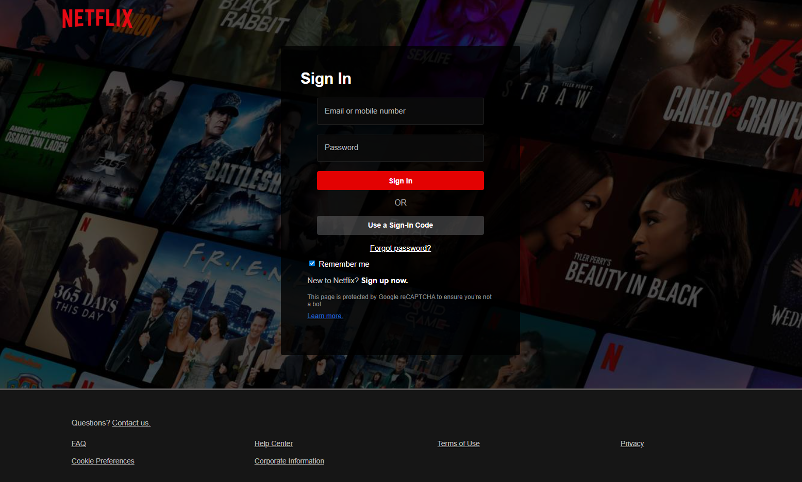

# Netflix Login Page

This project is a **Netflix Login Page clone** built with HTML, CSS, and a touch of JavaScript. It mimics the design and user interface of the Netflix sign-in page, featuring interactive form elements and a background image that adjusts based on screen size.

---

## Preview



---

## Features

- **Responsive design** that adjusts the layout for mobile, tablet, and desktop.
- **Styled form** that includes "Sign In," "Use a Sign-In Code," and "Forgot password?" buttons.
- **Checkbox for 'Remember me'** and links to Netflix's sign-up page and FAQs.
- **Background image** dynamically displayed with a black overlay to improve readability.
- **Hover effects** on the "Sign In" button and links.
- Inspired by the [Netflix Login](https://www.netflix.com/et/login).

---

## Technologies Used

- HTML5
- CSS3
- JavaScript (for any dynamic interaction)

---

## Usage

1. Clone or download the repository.
2. Open `index.html` in your browser to view the Netflix-style login page.
3. Interact with the buttons and links as you would on the actual Netflix login page.

---

## File Structure

```plaintext
root/
├─ index.html
├─ style.css
├─ screenshot.PNG

## Inspiration

This project was inspired by the Netflix login page and created following a tutorial from [themuellenator.github.io](https://themuellenator.github.io/).

---

## Author

Samuel Fikiru

---

## License

This project is open-source and free to use.

---

## File Structure
